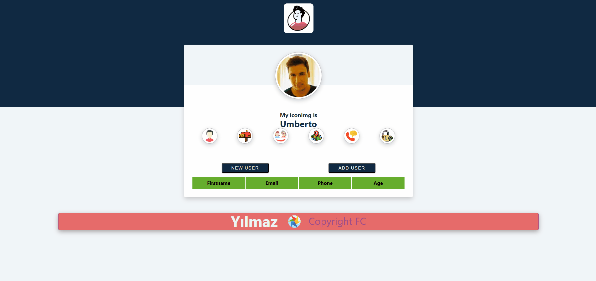

<h1>Soner Yılmaz</h1>
<h3>React-Random-User App</h3>

<br>

## Project Skeleton

```
React-Random-User App(folder)
|
|----readme.md         # Given to the students (Definition of the project)
SOLUTION
├── public
│     └── index.html
├── src
│    ├── components
│    │       ├── Header.jsx
│    │       │   
│    │       ├── User.jsx 
│    │       │
│    │       ├── Footer.jsx
│    │ 
│    ├──────pages 
│    │         ├── Home.jsx
│    │
│    │
│    │ 
│    ├── App.js
│    ├── index.js
│    └── index.css
├── package.json
└── yarn.lock
```

## Problem Statement

- We are adding a new project to our portfolios. So you and your colleagues have started to work on the project.

## Objective

Build a React-Random-User App using ReactJS.

### At the end of the project, following topics are to be covered;

- HTML

- CSS

- JS

- ReactJS

## React-Random-User App Demo
[React-Random-User App](https://user-random-react-app.vercel.app/)


## React-Random-User App Projects



